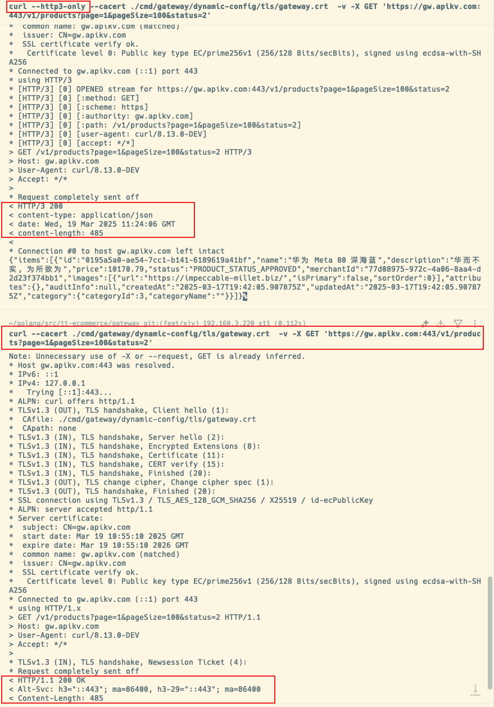

# Gateway
[](https://github.com/go-kratos/gateway/actions?query=branch%3Amain)
[](https://codecov.io/gh/go-kratos/gateway)

HTTP -> Proxy -> Router -> Middleware -> Client -> Selector -> Node

# Run
## 配置
`cmd/gateway/config.yaml`:
```yaml
envs:
  # 服务发现
  DISCOVERY_DSN: "consul://DISCOVERY_DSN:8500"
  # 服务发现配置路径
  DISCOVERY_CONFIG_PATH: "ecommerce/gateway/config.yaml"
  # 输出的日志等级
  LOG_LEVEL: "debug"
  # Casdoor 地址
  CASDOOR_URL: http://CASDOOR_URL:8000

  # 是否使用 TLS, 为 true 则使用, 需要配置CRT_FILE_PATH和KEY_FILE_PATH参数, 指定相对于入口文件(main.go)执行的路径
  USE_TLS: "false"
  # TLS 证书路径
  CRT_FILE_PATH: "dynamic-config/tls/gateway.crt"
  # TLS Key路径
  KEY_FILE_PATH: "dynamic-config/tls/gateway.key"
  
  # JWT 公钥证书
  JWT_PUBKEY_PATH: "/app/dynamic-config/policies/model.conf"
  
  # RBAC模型文件路径
  MODEL_FILE_PATH: "/app/dynamic-config/policies/model.conf"
  # RBAC策略文件路径
  POLICIES_FILE_PATH: "/app/dynamic-config/policies/policies.csv"
```

```bash
CASDOOR_URL=http://CASDOOR_URL:8000 \
DISCOVERY_DSN=consul://DISCOVERY_DSN:8500 \
DISCOVERY_CONFIG_PATH=ecommerce/gateway/config.yaml \
POLICIES_FILE_PATH=/app/dynamic-config/policies/policies.csv \
MODEL_FILE_PATH=/app/dynamic-config/policies/model.conf \
kr run
```

# gRPC
gRPC本质上是基于HTTP/2的协议, 它在调用时只使用POST方法, 所以gRPC的method只有POST方法, 所以gRPC的配置和HTTP的配置是一样的, 
但HTTP路径是你自己定义的, gRPC路径是protoc这些生成器自动根据由服务名和方法名组成的

path格式:
- 特定路径: /包名.服务名/方法名
- 通配符: /包名.服务名*

示例:
```protobuf
package ecommerce.product.v1;
service ProductService {}
```
path路径就是: 
- /ecommerce.product.v1.ProductService*
- /ecommerce.product.v1.ProductService/CreateProduct

完整的gRPC配置示例:
```yaml
endpoints:
  - path: /ecommerce.product.v1.ProductService*
    timeout: 1s
    method: POST
    protocol: GRPC
    backends:
      - target: 'discovery:///ecommerce-product-v1'
    retry:
      attempts: 3
      perTryTimeout: 0.1s
      conditions:
        - byStatusCode: '502-504'
        - byHeader:
            name: 'Grpc-Status'
            value: '14'

```

# 编写自定义中间件
1. 创建一个目录: ./middleware/routerfilter
2. 创建一个文件: ./middleware/routerfilter/routerfilter.go
3. 如果需要配置: : /api/gateway/middleware/routerfilter/routerfilter.proto
4. 实现接口
```go
package routerfilter

import "github.com/go-kratos/gateway/middleware"

func Middleware(c *config.Middleware) (middleware.Middleware, error) {
	return func(next http.RoundTripper) http.RoundTripper {
		return middleware.RoundTripperFunc(func(req *http.Request) (*http.Response, error) {
			// 在这里编写中间件逻辑
			// ...
			
			// 执行到这里时就意味着中间件已经执行完毕, 根据./cmd/gateway/config.yaml的中间件顺序继续执行下一个中间件
			return next.RoundTrip(req)
		}
	}
}
```

1. 当你需要提供给其他中间件或者全局使用时, 可以在`./api/gateway/config/v1/gateway.proto`配置通用的配置,然后在`func Middleware(c *config.Middleware) (middleware.Middleware, error) {} `使用`c.XXX` 来获取配置
2. 当你只需要你自身的配置的时候, 在`./api/gateway/middleware/` 创建, 例如 `routerfilter/v1/routerfilter.proto` 文件, 通过生成出的pb包来使用, 例如
```go
import v1 "github.com/go-kratos/gateway/api/gateway/middleware/routerfilter/v1"

options := &v1.RouterFilter{}`
````

5. 注册:
```go
package routerfilter
func init() {
	prometheus.MustRegister(requestsTotal, requestDuration)
	middleware.Register("router_filter", Middleware)
	fmt.Println("RouterFilter middleware initialized")
}

```

6. 添加中间件到主进程
```go
package main
import (
  _ "github.com/go-kratos/gateway/middleware/routerfilter" // 过滤中间件
)
```

## Protocol
* HTTP -> HTTP  
* HTTP -> gRPC  
* gRPC -> gRPC  

## Encoding
* Protobuf Schemas

## Endpoint
* prefix: /api/echo/*
* path: /api/echo/hello
* regex: /api/echo/[a-z]+
* restful: /api/echo/{name}

## TLS
1. 开发测试时可以使用自签名证书, 生产需要使用真实的证书, 项目支持自签名证书的生成, 可以使用以下命令生成自签名证书:
```bash
make https
```

2. 创建TLS配置

- USE_TLS: bool, 告诉网关使用TLS , 默认使用h2c协议, 即HTTP/2 over TCP, 即HTTP/2的明文传输
- USE_HTTP3: bool, 告诉网关使用HTTP/3 + QUIC, 实现使用 quic-go/quic-go
- HTTP_PORT: string, 告诉网关使用的端口, 使用TCP for HTTP/1.1 & HTTP/2, 例如: ":443"
- HTTP3_PORT: string, 告诉网关使用的端口, 使用UDP for HTTP/3, 例如: ":443", 当 TCP 和 UDP 端口重合时, 网关通过TLS的ALPN自动协商实现无缝回退
- CRT_FILE_PATH: string, 告诉网关使用的证书文件路径, 例如: "dynamic-config/tls/gateway.crt", 开发时保持默认值即可, 生产环境时需要把证书替换并修改名为`gateway.crt`
- KEY_FILE_PATH: string, 告诉网关使用的证书文件路径, 例如: "dynamic-config/tls/gateway.key", 开发时保持默认值即可, 生产环境时需要把证书替换并修改名为`gateway.key`
最低可运行示例:
修改`cmd/gateway/config.yaml` 然后复制到 Consul KV 中
```yaml
envs:
  # 服务发现
  DISCOVERY_DSN: consul://example.com:8500
  # 服务发现配置路径
  DISCOVERY_CONFIG_PATH: ecommerce/gateway/config.yaml
  # 是否使用 TLS, 为 true 则使用, 需要配置CRT_FILE_PATH和KEY_FILE_PATH参数, 指定相对于入口文件(main.go)执行的路径
  USE_TLS: "true"
  USE_HTTP3: "true"
  # TCP for HTTP/1.1 & HTTP/2
  HTTP_PORT: ":443"
  # UDP for HTTP/3
  HTTP3_PORT: ":443"
  # TLS 证书路径
  CRT_FILE_PATH: dynamic-config/tls/gateway.crt
  # TLS Key路径
  KEY_FILE_PATH: dynamic-config/tls/gateway.key
```



# Middleware
* cors
* auth
* color
* logging
* tracing
* metrics
* ratelimit
* datacenter
* jwt: 与casdoor集成
* rbac: 与casdoor的集成, 使用到了redis来缓存casbin策略, 基于角色的接口的权限控制
* router_filter: 路由过滤器, 用于过滤掉不需要的路由

### CORS

前端一般都要包含如下请求头:
```yaml
allowHeaders:
  - Authorization
  - Content-Type
  - X-Requested-With
  - DNT
  - Sec-Fetch-Dest
  - Sec-Fetch-Mode
  - Sec-Fetch-Site

```
站点规则如下:
请求来源	配置项	是否允许
- http://a.localhost:3000	.localhost	✅
- http://localhost:8080	.localhost	✅
- http://x.y.localhost	*.localhost	✅
- http://evil.localhost.com	.localhost	❌
- http://127.0.0.1:3000	127.0.0.1:3000	✅
如果需要修改, 可以修改`middleware/cors/cors.go`中的代码的`isOriginAllowed` 函数

### RouterFilter
路由过滤器, 用于过滤掉不需要的路由, 目前只支持正则匹配, 不支持通配符匹配, 不支持前缀匹配, 不支持后缀匹配, 不支持路径参数匹配,
该 router_filter 中间件支持以下类型的路由规则：

1. 精确路径匹配
   规则示例 ：/v1/products
   匹配行为 ：仅匹配完全相同的路径
   代码依据 ：正则表达式直接编译路径为精确匹配模式 
2. 通配符匹配
   a. 单层通配符 (/*)
   规则示例 ：/v1/products/*
   匹配行为 ：匹配单级子路径（如 /v1/products/123）
   实现原理 ：正则表达式将 /* 转换为 [^/]+ 
   b. 多层通配符 (/**)
   规则示例 ：/v1/products/**
   匹配行为 ：匹配多级子路径（如 /v1/products/123/details）
   实现原理 ：正则表达式将 /** 转换为 .+ 
3. 路径参数捕获
   规则示例 ：/v1/products/{id}
   匹配行为 ：提取路径参数（如 id=123）
   实现原理 ：通过正则表达式命名捕获组 (?P<id>[^/]+) 
4. HTTP 方法限制
   规则示例 ：
    ```yaml
    - path: /v1/products
      methods: [GET, POST]
    ```
- path: /v1/products
  methods: [GET, POST]
  匹配行为 ：仅允许指定的 HTTP 方法
  实现原理 ：检查请求方法是否在允许列表中 
5. 混合规则（路径 + 方法）
   规则示例 ：
```yaml
- path: /v1/auth
  methods: [POST, OPTIONS]
```

- path: /v1/auth
  methods: [POST, OPTIONS]
  匹配行为 ：同时满足路径和方法条件的请求才会被放行
  实现原理 ：路径和方法检查在 PathMatcher.Match() 中联合执行 
6. CORS 预检请求自动放行
   规则示例 ：所有 OPTIONS 请求
   匹配行为 ：直接返回 CORS 响应头，跳过后续中间件
   实现原理 ：在中间件入口处特殊处理 OPTIONS 方法 

配置示例:
```yaml
middlewares:
  - name: router_filter
    options:
      "@type": type.googleapis.com/gateway.middleware.routerfilter.v1.RouterFilter
      rules:
        # 精确路径 + 方法限制
        - path: /v1/auth
          methods: [POST, OPTIONS]
        
        # 通配符匹配
        - path: /v1/products/**
          methods: [GET]
        
        # 路径参数捕获
        - path: /v1/orders/{order_id}
          methods: [GET, DELETE]
```

## JWT
证书使用`x509`生成,4096位大小,加密算法是RS256(RSA+SHA256),有效期20年. 
证书文件在`/cmd/gatway`目录下, 证书文件名为`public.pem`

## RBAC

目前使用了官方的casbin的redis插件来缓存策略, 不一定是Redis, 也可以是任何支持redis协议的`rpush`工具即可 
目前的redis实例是没有设置密码的, 如果需要设置密码, 可以修改`middleware/rbac/rbac.go`中的代码的`initEnforcer` 函数,
常用的函数如下:
- 无加密: redisadapter.NewAdapter
- 包含密码: func NewAdapterWithPassword(network string, address string, password string) (*Adapter, error)
- 包含用户和密码: func NewAdapterWithUser(network string, address string, username string, password string) (*Adapter, error)

```go
package rbac

import (
	"fmt"
	"github.com/casbin/casbin/v2"
	redisadapter "github.com/casbin/redis-adapter/v3"
)

func initEnforcer() {
	a, err := redisadapter.NewAdapter("tcp", RedisAddr)
	if err != nil {
		panic(fmt.Errorf("failed to initialize redis adapter: %v", err))
	}

	enforcer, err := casbin.NewSyncedCachedEnforcer("./rbac_model.conf", a)
	if err != nil {
		panic(fmt.Errorf("failed to initialize enforcer: %v", err))
	}
	syncedCachedEnforcer = enforcer

	// 初始化策略
	initPolicies(enforcer)
}

```

当前模型:
```
[request_definition]
r = sub, obj, act

[policy_definition]
p = sub, obj, act, eft

[role_definition]
g = _, _
g2 = _, _

[policy_effect]
e = some(where (p.eft == allow)) && !some(where (p.eft == deny))

[matchers]
m = g(r.sub, p.sub) && keyMatch2(r.obj, p.obj) && regexMatch(r.act, p.act)
```

策略:
```csv
p, public, /v1/auth, POST, allow
p, public, /v1/products, GET, allow
p, public, /ecommerce.product.v1.ProductService/*, POST, allow

p, user, /v1/auth/profile, GET, allow
p, user, /v1/users/*, (GET|POST|PATCH|DELETE), allow
p, user, /v1/carts, (GET|POST|PATCH|DELETE), allow
p, user, /v1/carts/*, (GET|POST|DELETE), allow
p, user, /v1/checkout/*, POST, allow
p, user, /v1/orders, (GET|POST), allow
p, user, /v1/categories/*, GET, allow

p, merchant, /v1/products*, (GET|POST|PUT|DELETE), allow
p, merchant, /v1/products/*/submit-audit, POST, allow
p, merchant, /v1/categories/*, POST, allow
p, merchant, /v1/merchants, (GET|POST|PUT|DELETE|PATCH), allow

p, admin, /v1/users/*, (POST|PUT|DELETE|PATCH), allow
p, admin, /v1/categories/*, (POST|PUT|DELETE|PATCH), allow
p, admin, /v1/products/*, (GET|POST|PUT|DELETE|PATCH), allow
p, admin, /v1/products/*/audit, POST, allow
p, admin, /v1/merchants/*, (GET|POST|PUT|DELETE|PATCH), allow
p, admin, /v1/orders/*/paid, POST, allow
p, admin, /ecommerce.product.v1.ProductService/*, (POST|PUT|DELETE|PATCH), allow
p, anyone, /*, .*, deny

g, user, public
g, merchant, user
g, admin, merchant
```
